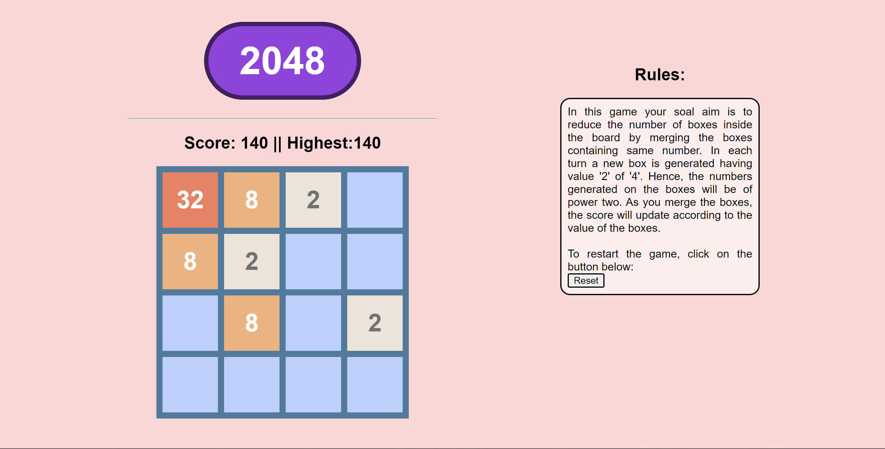

# 2048Game

Welcome to the 2048 game! This is a browser-based implementation of the popular puzzle game where you combine tiles to reach the elusive 2048 tile.

## How to Play

- Use the arrow keys on your keyboard (Up, Down, Left, Right) to slide the tiles in the corresponding direction.
- Tiles with the same number will combine when they collide.
- The goal is to create a tile with the number 2048.

## Features

- Responsive and interactive game interface.
- Keep track of your score as you merge tiles.
- Color-coded tiles for a visually appealing experience.
- End the game when no more moves are possible.
- Play and enjoy the challenge of reaching the 2048 tile!

## Getting Started

1. Clone this repository to your local machine using:

git clone https://github.com/HarshSharma1246/2048Game.git

2. Open the `index.html` file in your web browser to start playing.

## Contributing

Contributions are welcome! If you find any issues or have suggestions for improvements, feel free to open an issue or submit a pull request.

## Author

- Harsh Sharma
- GitHub: https://github.com/HarshSharma1246
- Email: 22m1832@iitb.ac.in
